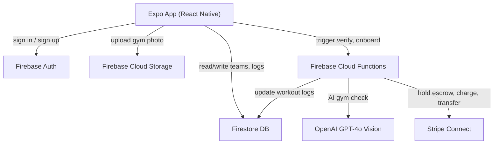

# Gym Accountability App

## GitHub

- Repo: `gymbet` (public) at `github.com/<you>/gymbet`
- Every completed todo gets its own commit pushed to `main`
- Branch strategy: `main` = stable/tested; feature branches per todo (e.g. `feat/auth-screens`)

## Tech Stack

- **Frontend:** React Native + Expo (Expo Router for file-based navigation)
- **Auth + DB + Storage:** Firebase (Auth, Firestore, Cloud Storage, Cloud Functions)
- **Payments:** Stripe Connect — each user onboards as an Express account (KYC) and adds a payment method as a Stripe Customer
- **AI Verification:** OpenAI GPT-4o Vision API (called from a Firebase Cloud Function, never from the client)
- **Camera:** `expo-camera` — camera-only mode, photo library access disabled at the API level
- **Notifications:** `expo-notifications` — workout day reminders

## Architecture Overview



## Payment Flow (Stripe Connect)

1. **Onboarding:** When a user first connects their wallet, they complete Stripe Express onboarding (KYC, bank/card link). This generates a `stripeAccountId` stored on their Firestore profile.
2. **Joining a team:** The wager amount is charged upfront via Stripe and held in the platform's escrow balance.
3. **Missed workout day:** A scheduled Cloud Function (runs nightly) checks who missed their promised workout day. For each miss, it charges the offender and creates Stripe Transfers to each other team member's Connect account.
4. **Team end:** Any remaining escrow is refunded/paid out.

## AI Verification Flow

1. User opens camera screen on a workout day (gallery disabled)
2. Photo is taken and uploaded to Firebase Cloud Storage
3. Cloud Function `verifyGymPhoto` is called with the storage path
4. Function downloads the image, sends it to OpenAI GPT-4o Vision with a strict prompt: *"Is this a real, public gym? Answer PASS or FAIL. FAIL if: phone held in front of gym photo, home setup, bedroom, not a gym."*
5. Result is written to the workout log doc in Firestore and returned to the client

## Firestore Schema

- `users/{uid}` — `displayName`, `email`, `stripeAccountId`, `stripeCustomerId`, `paymentMethodId`
- `teams/{teamId}` — `name`, `creatorId`, `wagerAmount`, `startDate`, `endDate`, `status`, `memberIds`
- `teamMembers/{teamId_userId}` — `workoutDays` (e.g. `["monday","thursday"]`), `totalMissed`, `totalEarned`
- `workoutLogs/{logId}` — `teamId`, `userId`, `date`, `status` (`pending`/`verified`/`failed`), `imageUrl`, `aiFeedback`
- `payments/{paymentId}` — `fromUserId`, `toUserId`, `teamId`, `amount`, `stripeTransferId`, `reason`

## App Screens (Expo Router)

```
app/
  (auth)/
    sign-in.tsx
    sign-up.tsx
  (app)/
    index.tsx              ← Dashboard: today's status, active teams
    teams/
      index.tsx            ← My teams list
      create.tsx           ← Create team + set wager
      [id].tsx             ← Team detail: members, schedule, leaderboard
      join.tsx             ← Join via invite code
    check-in.tsx           ← Camera check-in screen
    wallet.tsx             ← Stripe onboarding + payment history
    profile.tsx
```

## Key Packages

- `expo-camera` (camera-only capture)
- `@react-native-firebase/auth`, `firestore`, `functions`, `storage`
- `@stripe/stripe-react-native` (payment sheet + Connect onboarding)
- `expo-notifications`
- `zustand` (client state)
- `react-query` (server state / Firestore queries)
- `firebase-admin`, `stripe`, `openai` (Cloud Functions dependencies)

## Firebase Cloud Functions

- `verifyGymPhoto` — HTTPS callable; runs OpenAI Vision check, writes result to Firestore
- `processDailyMissed` — Pub/Sub scheduled (runs at midnight); finds all users who missed workout, triggers Stripe charges + transfers
- `onboardStripeUser` — creates Stripe Express account + returns onboarding URL
- `createTeamEscrow` — charges wager on team join, stores PaymentIntent
- `distributeWinnings` — called when team period ends, pays out escrow

## Implementation Notes

- Stripe Connect requires your platform to be approved for the use case (money movement between users). A test mode environment will work for development.
- The daily missed workout check should use Firebase Scheduled Functions (Pub/Sub cron) so it runs server-side with no client involvement.
- Camera capture uses `expo-camera`'s `takePictureAsync()` — there is no `ImagePicker` used anywhere, preventing photo library uploads.
- OpenAI calls must always happen server-side (Cloud Functions) to protect the API key.

